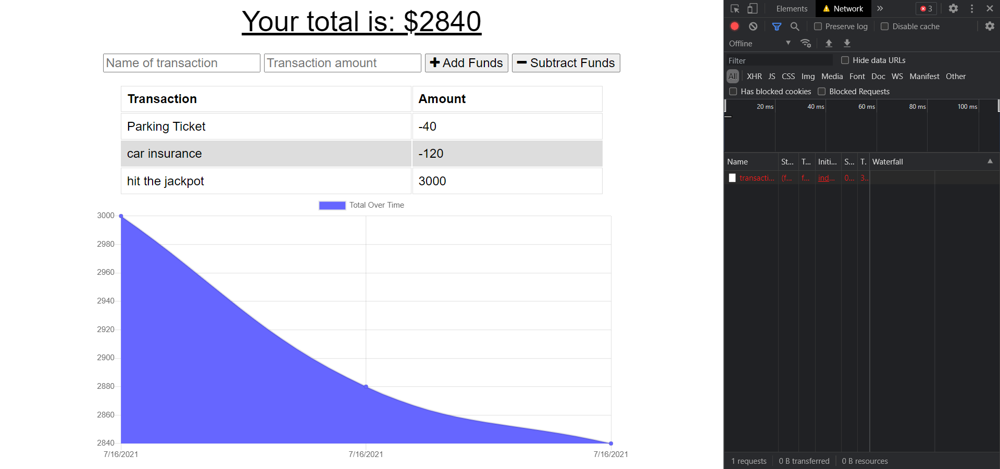
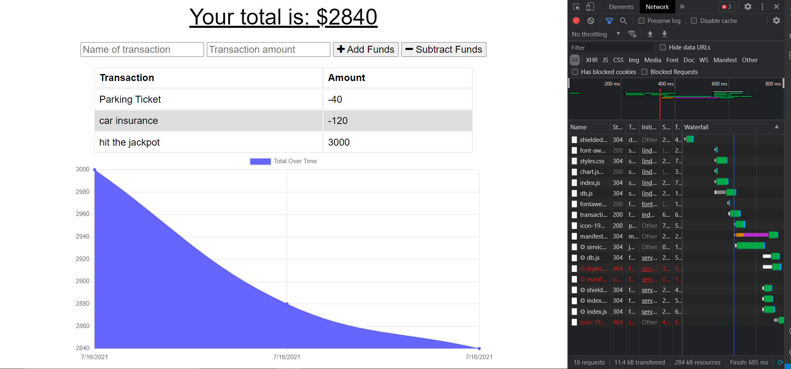

# Progressive-Budget-Tracker

  
  ## Description

   An application that helps track withdrawls and deposits within a specific budget. Illustrated both tabular and graphical form. 
   * User can enter deposits and expenses both online and offline.
   * Offline transactions will reappear once network is back online. 
  
  ## Table of Contents

  * [Installation](#installation)

  * [Usage](#usage)

  * [License](#license)

  * [Questions](#questions)

  
  ## Installation

  Packages to install with 'npm i'
  * compression
  * express
  * lite-server
  * mongoose
  * morgan

  ## Usage
  * Offline
  
  * Online
  

  

  ## License
 Licensed under MIT

  ## Questions

  https://github.com/jugrajn

    - Reach me at jugraj.nijjar@gmail.com

